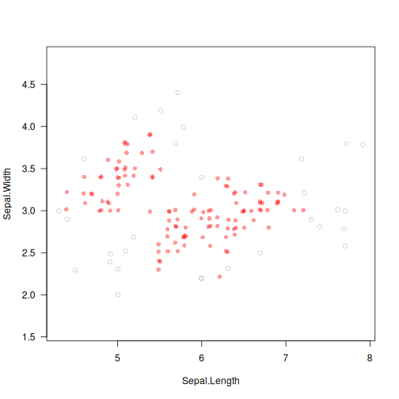

# deadwood: Deadwood: Outlier Detection via Trimming of Mutual Reachability Minimum Spanning Trees

## Description

Deadwood is an anomaly detection algorithm based on Mutual Reachability Minimum Spanning Trees. It trims protruding tree segments and marks small debris as outliers.

More precisely, the use of a mutual reachability distance pulls peripheral points farther away from each other. Tree edges with weights beyond the detected elbow point are removed. All the resulting connected components whose sizes are smaller than a given threshold are deemed anomalous.

## Usage

``` r
deadwood(d, ...)

## Default S3 method:
deadwood(
  d,
  M = 0L,
  contamination = NA_real_,
  max_debris_size = NA_real_,
  max_contamination = 0.5,
  ema_dt = 0.01,
  distance = c("euclidean", "l2", "manhattan", "cityblock", "l1", "cosine"),
  verbose = FALSE,
  ...
)

## S3 method for class 'dist'
deadwood(
  d,
  M = 0L,
  contamination = NA_real_,
  max_debris_size = NA_real_,
  max_contamination = 0.5,
  ema_dt = 0.01,
  verbose = FALSE,
  ...
)

## S3 method for class 'mstclust'
deadwood(
  d,
  contamination = NA_real_,
  max_debris_size = NA_real_,
  max_contamination = 0.5,
  ema_dt = 0.01,
  verbose = FALSE,
  ...
)

## S3 method for class 'mst'
deadwood(
  d,
  contamination = NA_real_,
  max_debris_size = NA_real_,
  max_contamination = 0.5,
  ema_dt = 0.01,
  cut_edges = NULL,
  verbose = FALSE,
  ...
)
```

## Arguments

|  |  |
|----|----|
| `d` | a numeric matrix with $n$ rows and $p$ columns (or an object coercible to one, e.g., a data frame with numeric-like columns), an object of class `dist` (see [`dist`](https://stat.ethz.ch/R-manual/R-devel/library/stats/help/dist.html)), an object of class `mstclust` (see <span class="pkg">genieclust</span> and <span class="pkg">lumbermark</span>), or an object of class `mst` (see [`mst`](mst.md)) |
| `...` | further arguments passed to [`mst`](mst.md) |
| `M` | smoothing factor; $M \leq 1$ gives the selected `distance`; otherwise, the corresponding mutual reachability distance is used |
| `contamination` | single numeric value or `NA`; the estimated (approximate) proportion of outliers in the data set; if `NA`, the contamination amount will be determined by identifying the most significant elbow point of the curve comprised of increasingly ordered tree edge weights |
| `max_debris_size` | single integer value or `NA`; the maximal size of the leftover connected components that will be considered outliers; if `NA`, $\sqrt{n}$ is assumed |
| `max_contamination` | single numeric value or `NA`; maximal contamination level assumed when `contamination` is `NA` |
| `ema_dt` | single numeric value or `NA`; controls the smoothing parameter $\alpha = 1-\exp(-dt)$ of the exponential moving average (in elbow detection), $y_i = \alpha x_i + (1-\alpha) y_{i-1}$, $y_1 = x_1$ |
| `distance` | metric used in the case where `d` is a matrix; one of: `"euclidean"` (synonym: `"l2"`), `"manhattan"` (a.k.a. `"l1"` and `"cityblock"`), `"cosine"` |
| `verbose` | logical; whether to print diagnostic messages and progress information |
| `cut_edges` | numeric vector or `NULL`; $k-1$ indexes of the tree edges whose omission lead to $k$ connected components (clusters), where the outliers are to be sought independently; most frequently this is generated via <span class="pkg">genieclust</span> or <span class="pkg">lumbermark</span>. |

## Details

As with all distance-based methods (this includes k-means and DBSCAN as well), applying data preprocessing and feature engineering techniques (e.g., feature scaling, feature selection, dimensionality reduction) might lead to more meaningful results.

If `d` is a numeric matrix or an object of class `dist`, [`mst`](mst.md) will be called to compute an MST, which generally takes at most $O(n^2)$ time. However, by default, for low-dimensional Euclidean spaces, a faster algorithm based on K-d trees is selected automatically; see [`mst_euclid`](https://quitefastmst.gagolewski.com/rapi/mst_euclid.html) from the <span class="pkg">quitefastmst</span> package.

Once the spanning tree is determined ($\Omega(n \log n)$-$O(n^2)$), the Deadwood algorithm runs in $O(n)$ time. Memory use is also $O(n)$.

## Value

A logical vector of length $n$, where TRUE denotes outliers.

The `mst` attribute gives the computed minimum spanning tree which can be reused in further calls to the functions from <span class="pkg">genieclust</span>, <span class="pkg">lumbermark</span>, and <span class="pkg">deadwood</span>. `cut_edges` gives the `cut_edges` passed as argument. `contamination` gives the detected contamination levels in each cluster (which can be different from the observed proportion of outliers detected).

## Author(s)

[Marek Gagolewski](https://www.gagolewski.com/)

## References

M. Gagolewski, deadwood, in preparation, 2026, TODO

V. Satopaa, J. Albrecht, D. Irwin, B. Raghavan, Finding a \"Kneedle\" in a haystack: Detecting knee points in system behavior, In: 31st Intl. Conf. Distributed Computing Systems Workshops, 2011, 166-171, [doi:10.1109/ICDCSW.2011.20](https://doi.org/10.1109/ICDCSW.2011.20)

R.J.G.B. Campello, D. Moulavi, J. Sander, Density-based clustering based on hierarchical density estimates, Lecture Notes in Computer Science 7819, 2013, 160-172, [doi:10.1007/978-3-642-37456-2_14](https://doi.org/10.1007/978-3-642-37456-2_14)

## See Also

The official online manual of <span class="pkg">deadwood</span> at <https://deadwood.gagolewski.com/>

## Examples


``` r
library("datasets")
data("iris")
X <- jitter(as.matrix(iris[1:2]))  # some data
is_outlier <- deadwood(X, M=5)
plot(X, col=c("#ff000066", "#55555555")[is_outlier+1],
    pch=c(16, 1)[is_outlier+1], asp=1, las=1)
```


